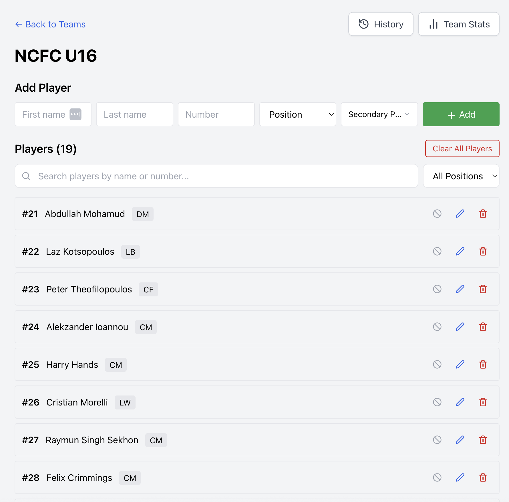
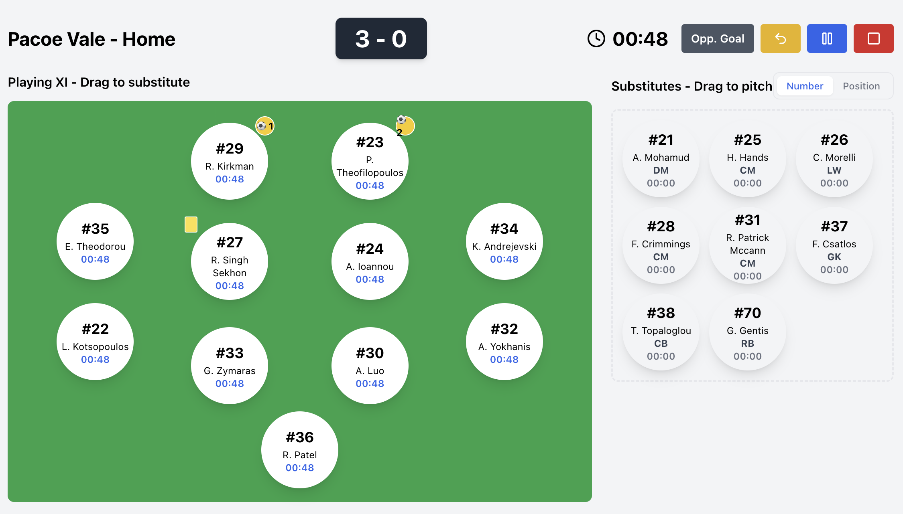
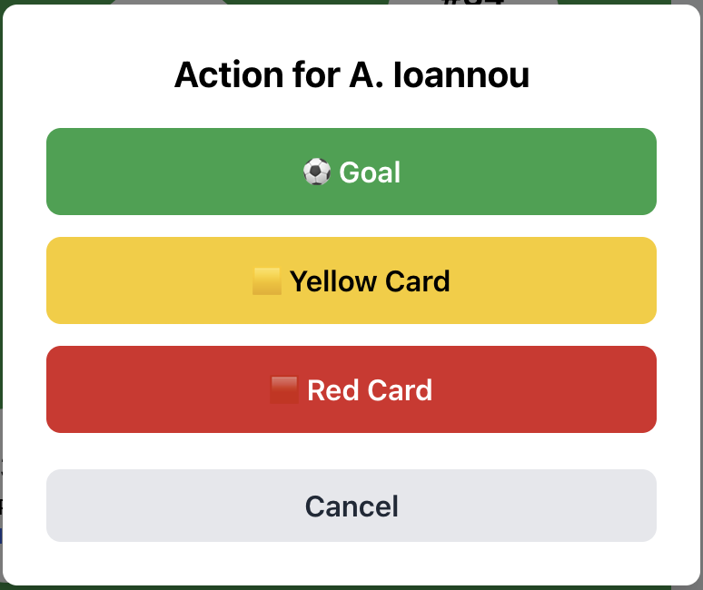
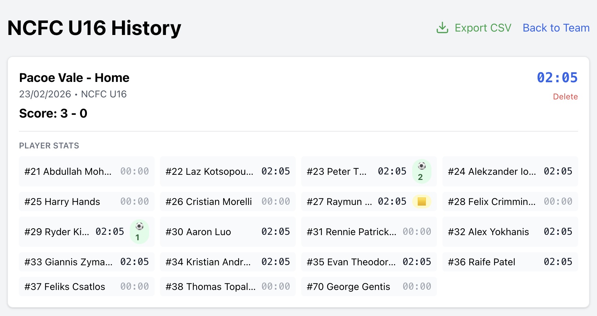
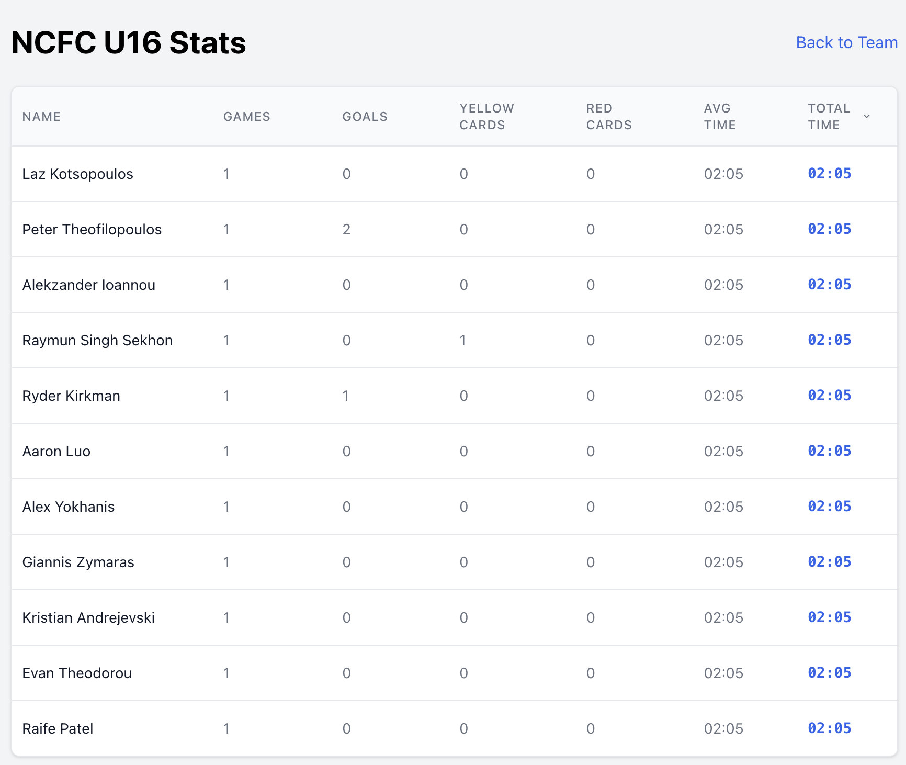

# Soccer Time Tracker - User Manual

Welcome to the Soccer Time Tracker! This application helps you manage your soccer team, track game time, substitutions, goals, and cards, and view historical statistics.

## Table of Contents
1.  [Getting Started](#getting-started)
2.  [Managing Teams](#managing-teams)
    *   [Creating a Team](#creating-a-team)
    *   [Importing a Team](#importing-a-team)
3.  [Managing Players](#managing-players)
    *   [Adding Players](#adding-players)
    *   [Editing Players](#editing-players)
    *   [Player Availability](#player-availability)
4.  [Starting a Game](#starting-a-game)
    *   [Formation Setup](#formation-setup)
    *   [Auto-Assign Players](#auto-assign-players)
5.  [Live Game Tracking](#live-game-tracking)
    *   [Game Controls](#game-controls)
    *   [Substitutions](#substitutions)
    *   [Recording Events (Goals, Cards)](#recording-events)
6.  [Game History & Statistics](#game-history--statistics)

---

## 1. Getting Started 

When you first open the application, you will be greeted by the **Access Gate**.
1.  Enter your access code.
2.  Click **Enter**.

Once authenticated, you will see the **Home Screen**. This is your central hub for managing teams and viewing past games.

---

## 2. Managing Teams

### Creating a Team
1.  On the Home Screen, locate the **Create New Team** section.
2.  Enter a **Team Name** (e.g., "Tigers FC").
3.  Enter a **Default Duration** for games in minutes (e.g., "80").
4.  Click the **Create** button.

### Importing a Team
If you have a CSV file with your roster, you can import it directly.
1.  Click the **Import Team CSV** button.
2.  Select your CSV file.
    *   **CSV Format:** `First Name, Last Name, Number, Position, Secondary Positions...`
    *   *Example:* `John, Doe, 10, CF, RW;LW`

---

## 3. Managing Players

Click on a team name from the "My Teams" list to enter the **Team Detail View**.

### Adding Players
1.  Fill in the **First Name**, **Last Name**, and **Number**.
2.  Select a **Primary Position** from the dropdown (e.g., GK, CB, CM, CF).
3.  (Optional) Click **Secondary Positions** to select other positions the player can play.
4.  Click **Add**.

### Editing Players
1.  Locate the player in the list.
2.  Click the **Edit (Pencil)** icon next to their name.
3.  The form at the top of the page will populate with their details.
4.  Make your changes and click **Update**.

### Player Availability
If a player is absent for a game:
1.  Click the **Ban/Block** icon next to their name.
2.  The player will be grayed out and marked as `(Unavailable)`.
3.  They will not be included in auto-assignments for the next game.

---

## 4. Starting a Game

From the Team Detail View, click **Set Formation & Start Game**.

### Formation Setup
1.  **Select Formation:** Choose between `1-4-4-2` or `1-4-3-3` from the dropdown.
2.  **Assign Players:**
    *   **Drag and Drop:** Drag players from the "Available Players" list onto a position on the field.
    *   **Auto-Assign:** Click **Auto-Assign Players** to automatically fill the field based on player positions.

### Auto-Assign Players
Click the **Auto-Assign Players** button to automatically fill the formation slots with available players based on their primary and secondary positions.

### Game Settings
1.  **Game Name:** Enter a name for this match (e.g., "vs Lions").
2.  **Duration:** Adjust the game duration if different from the default.
3.  Click **Start Game**.

---

## 5. Live Game Tracking

This is the main screen you will use during the match.

### Game Controls
*   **Play/Pause:** Click the **Play** button to start the timer. Click **Pause** to stop it.
*   **Opp. Goal:** Click to record a goal scored by the opponent.
*   **Undo:** Click the yellow **Undo** button to revert the last action (goal, card, etc.).
*   **End Game:** Click the red **Stop (Square)** button to finish the match.

### Substitutions
1.  **Click to Sub:**
    *   Click a player on the **Bench** (Green ring appears).
    *   Click a player on the **Field** (Red ring appears).
    *   Click the **Substitute** button that appears at the bottom right.
2.  **Drag and Drop:** Alternatively, drag a player from the bench and drop them onto a player on the field.

### Recording Events
Right-click (or long-press on touch devices) on a player on the field to open the **Action Menu**.

*   **Goal:** Records a goal for that player. A soccer ball icon ⚽ appears on their token.
*   **Yellow Card:** Records a yellow card. A yellow card icon 🟨 appears.
    *   *Note:* A second yellow card automatically converts to a Red Card and removes the player from the field.
*   **Red Card:** Records a red card. The player is removed from the field and marked with a red card icon 🟥.

---

## 6. Game History & Statistics

### History
From the Team Detail View, click **History**.
*   View a list of all past games.
*   See the final score, total time, and individual player stats for each game.
*   **Export CSV:** Download the history data for spreadsheet analysis.

### Team Stats
From the Team Detail View, click **Team Stats**.
*   View aggregated statistics for the team.
*   Sort by Goals, Assists, Time Played, etc.

